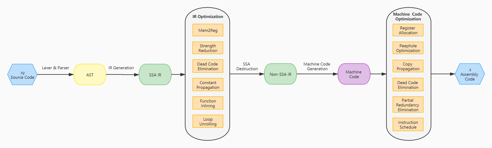

# CSC2021-NKU-TEDA
2021年全国大学生计算机系统能力培养大赛编译系统设计赛项目  
团队学校：南开大学  
团队名称：天津泰达  
团队成员：费迪 沈哲 孙一丁 杨科迪  
指导教师：王刚 李忠伟

## 项目简介
该项目为一个单前端单后端的编译器，可对SysY语言进行编译，生成armv7a架构的汇编语言。  

项目总体上分为前端、中端和后端三部分。前端的词法分析和语法分析基于lex和yacc实现，中间代码与llvm IR兼容，后端生成arm汇编代码。  
编译器实现了各种代码优化算法，具有较好的优化能力。
## 项目构建
在项目根目录执行
```
make app
```
## 项目运行
```
Usage: build/compiler [options] file
Options: 
    --ast           Generate ast.
    --IR            Generate IR.
    -o              Specify output file.
    -O2             Generate optimized code.
```
## 项目特性
### 控制流分析
* 支配结点
* 直接支配结点
* 支配边界
* 循环
### 数据流分析
* 到达定义
* 活跃变量分析

### 中间代码优化
基于SSA形式的中间代码做了如下优化：
* Mem2Reg
* 强度削弱
* 常量传播
* 死代码删除
* 无用控制流删除
* 循环展开
* 函数内联

非SSA形式的中间代码做了如下优化：
* 窥孔优化  
* 复制传播
* 死代码删除
* 部分冗余消除
* 循环向量化

### 目标代码优化

1. 寄存器分配  
* 基于图着色算法  
* 使用到达定义和活跃变量分析数据流信息构建冲突图
* 寄存器合并
* 根据循环嵌套层数估算溢出代价
* 进行寄存器分配，将虚拟寄存器映射到12个arm通用寄存器

2. 指令调度
* 基于关键路径的列表调度算法
* 提高指令级并行能力

## 项目演示
对于SysY代码：
```
// test if-else
int ifElse() {
  int a;
  a = 5;
  if (a == 5) {
    a = 25;
  } else {
    a = a * 2;
  }
  return (a);
}


int main() {
  return (ifElse());
}
```

编译器生成的语法树如下：
```
#@26	NODE_PROG	child: @21 
#@21	NODE_STMT	STMT_FUNC	child: @20 	sibling: @25 
#@20	NODE_STMT	STMT_COMPOUND	child: @0 
#@0	    NODE_DECL	a	offset: 0		sibling: @3 
#@3	    NODE_STMT	STMT_ASSIGN	child: @1 @2 	sibling: @17 
#@1	    NODE_EXPR	a
#@2	    NODE_EXPR	5
#@17	NODE_STMT	STMT_IF	child: @6 @10 @16 	sibling: @19 
#@6	    NODE_EXPR	OP_E	child: @4 @5 
#@4	    NODE_EXPR	a
#@5	    NODE_EXPR	5
#@10	NODE_STMT	STMT_COMPOUND	child: @9 
#@9	    NODE_STMT	STMT_ASSIGN	child: @7 @8 
#@7	    NODE_EXPR	a
#@8	    NODE_EXPR	25
#@16	NODE_STMT	STMT_COMPOUND	child: @15 
#@15	NODE_STMT	STMT_ASSIGN	child: @11 @14 
#@11	NODE_EXPR	a
#@14	NODE_EXPR	OP_MUL	child: @12 @13 
#@12	NODE_EXPR	a
#@13	NODE_EXPR	2
#@19	NODE_STMT	STMT_RETURN	child: @18 
#@18	NODE_EXPR	a
#@25	NODE_STMT	STMT_FUNC	child: @24 
#@24	NODE_STMT	STMT_COMPOUND	child: @23 
#@23	NODE_STMT	STMT_RETURN	child: @22 
#@22	NODE_EXPR	OP_FUNC
```
生成的中间代码：
```
define dso_local i32 @ifElse() #0 {
0:
  %a5 = alloca i32, align 4
  store i32 5, i32* %a5, align 4
  %1 = load i32, i32* %a5, align 4
  %2 = icmp eq i32 %1, 5
  br i1 %2, label %3, label %4
3:                                                ; preds = %0
  store i32 25, i32* %a5, align 4
  br label %5
4:                                                ; preds = %0
  br label %7
5:                                                ; preds = %3, %7
  %6 = load i32, i32* %a5, align 4
  ret i32 %6
7:                                                ; preds = %4
  %8 = load i32, i32* %a5, align 4
  %9 = mul i32 %8, 2
  store i32 %9, i32* %a5, align 4
  br label %5
}
define dso_local i32 @main() #0 {
0:
  %1 = call i32 @ifElse()
  ret i32 %1
}
```

生成的未经优化的汇编代码：
```
	.arch armv7-a
	.arch_extension crc
	.arm
	.fpu neon
	.global ifElse
	.type ifElse , %function
ifElse:
	sub sp, sp, #4
	mov r1, #5
	ldr r0, =0
	str r1, [sp, r0]
	ldr r0, [sp, #0]
	cmp r0, #5
	beq	.L8
	ldr r1, [sp, #0]
	mov r0, #2
	mul r1, r1, r0
	ldr r0, =0
	str r1, [sp, r0]
.L14:
	ldr r0, [sp, #0]
	add sp, sp, #4
	bx	lr
	mov r1, #25
	ldr r0, =0
	str r1, [sp, r0]
	b	.L14
	.global main
	.type main , %function
main:
	push {lr}
	bl	ifElse
	pop {lr}
	bx	lr

	.ident	"NKU-TEDA"
```

经过优化后生成：
```
	.arch armv7-a
	.arch_extension crc
	.arm
	.fpu neon
	.global ifElse
	.type ifElse , %function
ifElse:
	mov r0, #25
	bx	lr

	.global main
	.type main , %function
main:
	push {lr}
	bl	ifElse
	pop {lr}
	bx	lr

	.ident	"NKU-TEDA"
```